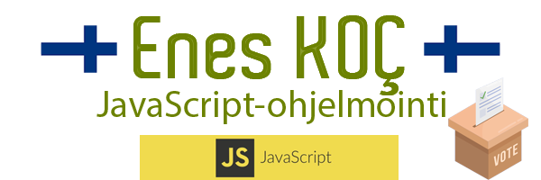
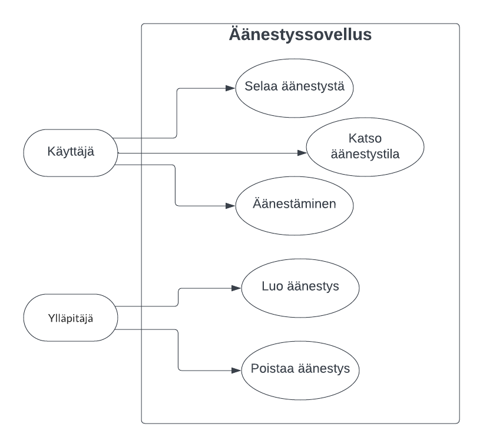

# Ohjelmiston toteutus UseCase-kaavion pohjalta

## Luo äänestys
- **Käyttäjät:** *ylläpitäjä*
- **Tavoite:** *luoda uusi äänestys*
- **Laukaisija:** *ylläpitäjän tarve*
- **Esiehto:** *ylläpitäjä on kirjautunut sivuille*
- **Jälkiehto:** *uusi äänestys on luotu*
- **Käyttötapauksen kulku:** 
    1. *Ylläpitäjä aloittaa äänetyksen luomistoiminnon*
    2. *Järjestelmä näyttää äänestyslomakkeen*
    3. *Ylläpitäjä täyttää lomakkeen*
    4. *Järjestelmä validoi lomakkeen*
    5. *Järjestelmä luo äänestyksen*
- **Poikkeuksellinen toiminta:**
    - 4a. *Tyhjiä merkintöjä ei voi tehdä*

## Äänestä
- **Käyttäjät:** *käyttäjä, ylläpitäjä*
- **Tavoite:** *äänestää äänestyksessä*
- **Laukaisija:** *käyttäjän halu*
- **Esiehto:** *käyttäjä on kirjautunut sivuille*
- **Jälkiehto:** *äänestykseen on lisätty ääni*
- **Käyttötapauksen kulku:** 
    1. *Käyttäjä valitsee äänestyksen*
    2. *Syöttää käyttäjänimen*
    3. *Käyttäjä äänestää haluamaansa vaihtoehtoa*
    4. *Järjestelmä päivittää ja näyttää äänestystulokset*
- **Poikkeuksellinen toiminta:**
    - 3a. *Äänestyspainikkeita ei voi käyttää, jos käyttäjä ei kirjoita nimeään*

## Poista äänestys
- **Käyttäjät:** *ylläpitäjä*
- **Tavoite:** *poistaa äänestys*
- **Laukaisija:** *ylläpitäjän tarve*
- **Esiehto:** *käyttäjä on kirjautunut sivuille*
- **Jälkiehto:** *äänestys on poistettu*
- **Käyttötapauksen kulku:** 
    1. *Käyttäjä valitsee halutun äänen ja painaa poistopainiketta*
    2. *Järjestelmä poistaa äänestyksen*
- **Poikkeuksellinen toiminta:**
    - 1a. *Jos käyttäjällä ei ole ylläpitäjän oikeuksia, poistonappi ei ole näkyvissä.*

## Katso tilanne
- **Käyttäjät:** *käyttäjä, ylläpitäjä*
- **Tavoite:** *näyttää äänestyksen tilanteen*
- **Laukaisija:** *käyttäjän halu*
- **Esiehto:** *käyttäjä on kirjautunut sivuille*
- **Jälkiehto:** *käyttäjä näkee äänestyksen tilanteen*
- **Käyttötapauksen kulku:** 
    1. *Käyttäjä valitsee äänestyksen ja painaa tilanteen näyttönappia*
    2. *Näkee äänestystulokset*
    3. *Järjestelmä näyttää äänestystulokset*
- **Poikkeuksellinen toiminta:**
    - 1a. *Käyttäjä ei voi suorittaa hallinnollisia toimintoja.*

Yleinen opetusmateriaali JavaScript-peruskurssille aloittelijoille. Voit myös aktiivisesti käyttää sitä verkkosivuston https://uml.enes.fi kautta.

## Käyttöoikeudet
Sinulla on täysi oikeus käyttää tätä materiaalia omaan oppimiseesi. Lisäksi opettajat voivat saada pääsyn kaikkeen sisältöön ja käyttää sitä opiskelijoidensa kanssa. Kuitenkin kaikkien, jotka käyttävät tätä materiaalia - oli tarkoituksena mikä tahansa - tulee säilyttää alkuperäisen materiaalin viite, joka on luotu ja tarjottu Enes KOC toimesta. Tätä sisältöä ei saa missään tilanteessa käyttää kirjojen tai oppimateriaalien laatimiseen kokonaan tai osittain taloudellisen hyödyn saamiseksi kirjailijoiden, kustantajien tai oppilaitosten toimesta.

